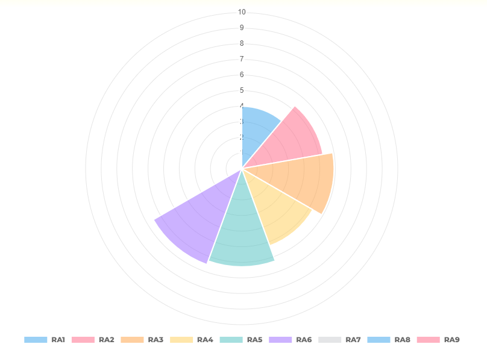

# Manual de uso de los graficos
### Marc Morlá Isern

## Implementación del código 📝
Primero tenemos que importar la libreria de Chart.js

    import {Chart} from "chart.js/auto";

Escribimos el código y lo importamos al HTML

    this.dataSource =  Object.keys(response).map(key => ({header: key, content1: response[key].Media.toFixed(2)}));

          this.chartData = {
            labels: this.dataSource.map(item => item.header),
            datasets: [{
              data: this.dataSource.map(item => item.content1),
              showLine: false,
            }],
          };

          this.chart = new Chart('canvas', {
            type: 'polarArea',
            data: this.chartData,
            options: {
              scales: {
                r: {
                  max: 10,
                },
              },
              aspectRatio: 1.5,
              plugins: {
                legend: {
                  position: "bottom",
                  labels: {
                    font: {
                      family: 'Montserrat',
                      weight: 800,
                    }
                  }
                }
              },
            },
          });

Para poder visualizar el gráfico tenemos que añadir este tag al HTML pertinente.

    <canvas id="canvas"></canvas>

## Gráfico 📊
Y asi es como se veria el gráfico de la libreria Chart.js implementado en nuestro Proyecto Quesito 
